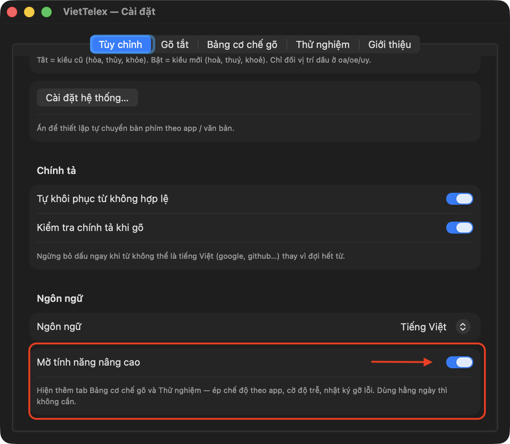
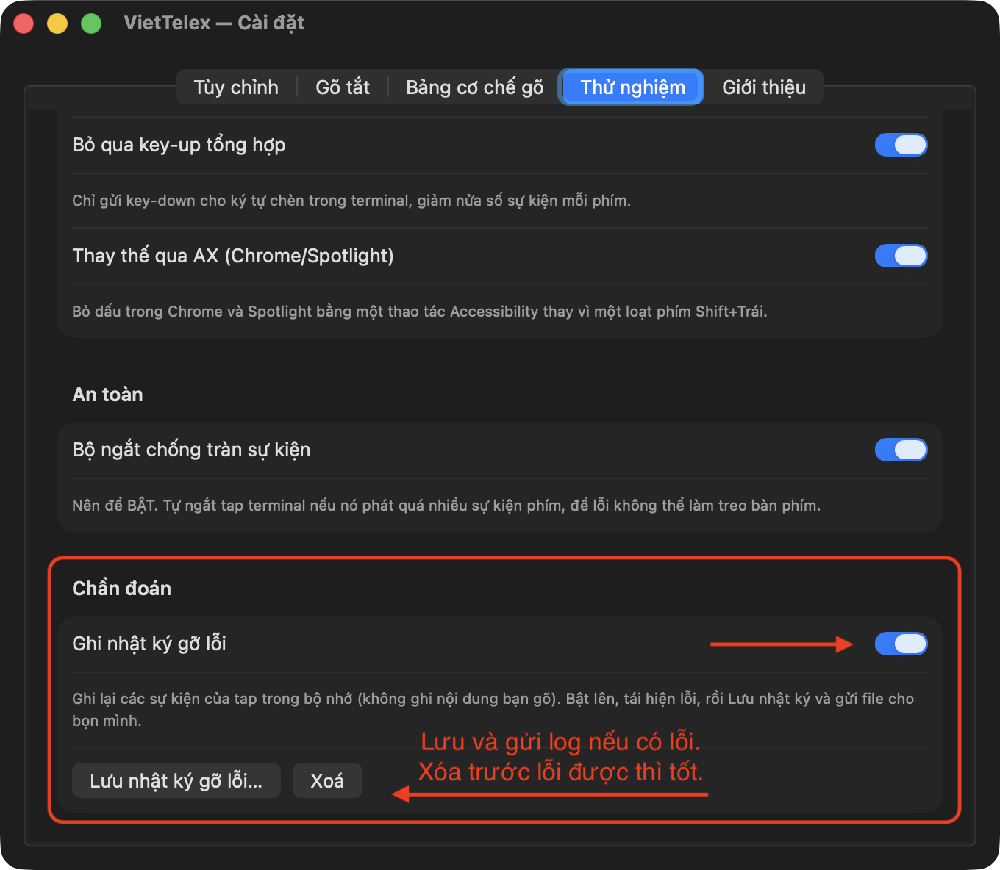

# Hướng dẫn báo lỗi VietTelex

Cảm ơn bạn đã dành thời gian báo lỗi 🙏 Một issue tốt kèm nhật ký gỡ lỗi giúp bọn mình sửa trong vài giờ thay vì vài ngày đoán mò.

Gửi issue tại: **https://github.com/ptrinh/viettelex/issues/new**

## Trước khi báo

1. **Cập nhật bản mới nhất** — rất nhiều lỗi đã được sửa giữa các bản. Mở icon **Ｖ** trên menu bar → **Cài đặt…** → tab **Giới thiệu** → *Kiểm tra cập nhật* (hoặc `brew upgrade --cask viettelex`). Thử lại lỗi trên bản mới trước khi báo.
2. **Tìm nhanh trong [issues](https://github.com/ptrinh/viettelex/issues)** xem đã có ai báo chưa — nếu có rồi, thả 👍 và bổ sung thông tin vào đó.

## Nội dung cần có trong issue

Copy mẫu này vào issue và điền:

```markdown
**Phiên bản:** (menu Ｖ → Trạng thái, dòng đầu — ví dụ: VietTelex 1.4.6 build 26)
**macOS:** (ví dụ: macOS 26.5)
**App bị lỗi:** (ví dụ: Chrome — và WEBSITE cụ thể nếu là trang web; Terminal; Excel…)
**Chế độ gõ:** (Bỏ dấu tự do bật/tắt, Simple Telex bật/tắt — xem tab Tùy chỉnh)

**Các bước tái hiện:**
1. Mở …
2. Gõ chuỗi phím: `theme` (ghi ĐÚNG chuỗi phím bấm, không phải chữ mong muốn)
3. …

**Kết quả mong đợi:** thêm
**Kết quả thực tế:** themee

**Nhật ký gỡ lỗi:** (đính kèm file — xem hướng dẫn bên dưới)
```

Mẹo: với lỗi hiển thị (chữ nhảy, bôi đen, mất chữ…), một **video quay màn hình ngắn** (⌘⇧5) đáng giá hơn nghìn chữ.

## Cách lấy nhật ký gỡ lỗi

Nhật ký chỉ ghi **sự kiện của bộ gõ** (app nào, chế độ nào, probe ra sao) — **không ghi nội dung bạn gõ**.

### Bước 1 — Mở tính năng nâng cao

Menu **Ｖ** → **Cài đặt…** → tab **Tùy chỉnh**, kéo xuống cuối, bật **Mở tính năng nâng cao**:



### Bước 2 — Bật ghi nhật ký, tái hiện lỗi, lưu file

Sang tab **Thử nghiệm** (mới hiện ra), kéo xuống mục **Chẩn đoán**:

1. Bật **Ghi nhật ký gỡ lỗi**.
2. Bấm **Xoá** để nhật ký sạch (nếu xóa trước khi tái hiện được thì log càng gọn càng tốt).
3. Quay lại app bị lỗi, **tái hiện lỗi** (gõ vài từ cho lỗi xuất hiện).
4. Quay lại đây, bấm **Lưu nhật ký gỡ lỗi…** và lưu file.



### Bước 3 — Đính kèm vào issue

Kéo-thả file `.txt` vừa lưu vào ô soạn issue trên GitHub (GitHub tự upload). Xong!

> Lưu ý: nhật ký là vòng đệm 400 dòng gần nhất — hãy lưu file **ngay sau khi** tái hiện lỗi, đừng gõ thêm nhiều rồi mới lưu.

## Lỗi liên quan quyền Trợ năng

Nếu gõ tiếng Việt chết hẳn trong Terminal/iTerm/Chrome sau khi cập nhật app, thường là quyền Trợ năng bị kẹt. Menu **Ｖ** → **Trạng thái** sẽ tự hiện hướng dẫn sửa một chạm khi phát hiện tình trạng này — làm theo trước khi báo lỗi.
