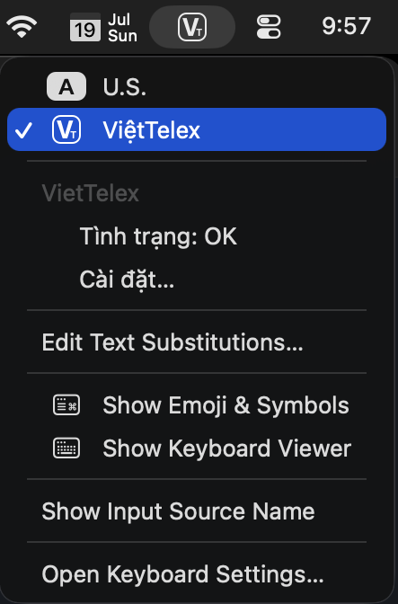
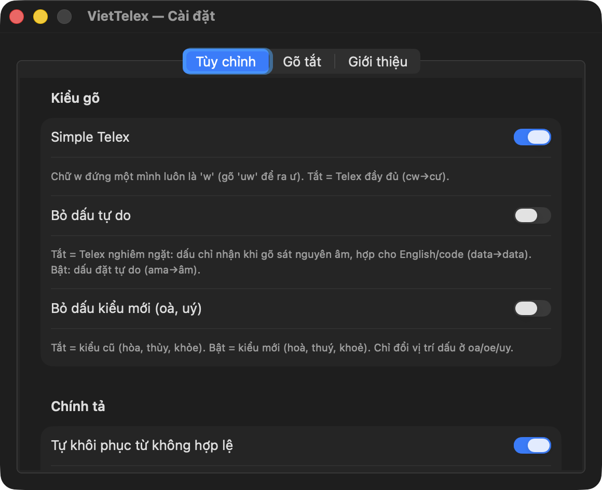
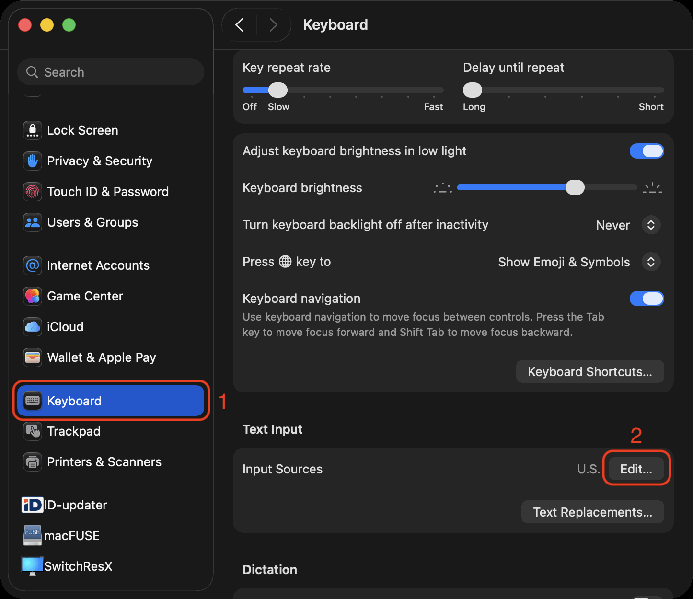
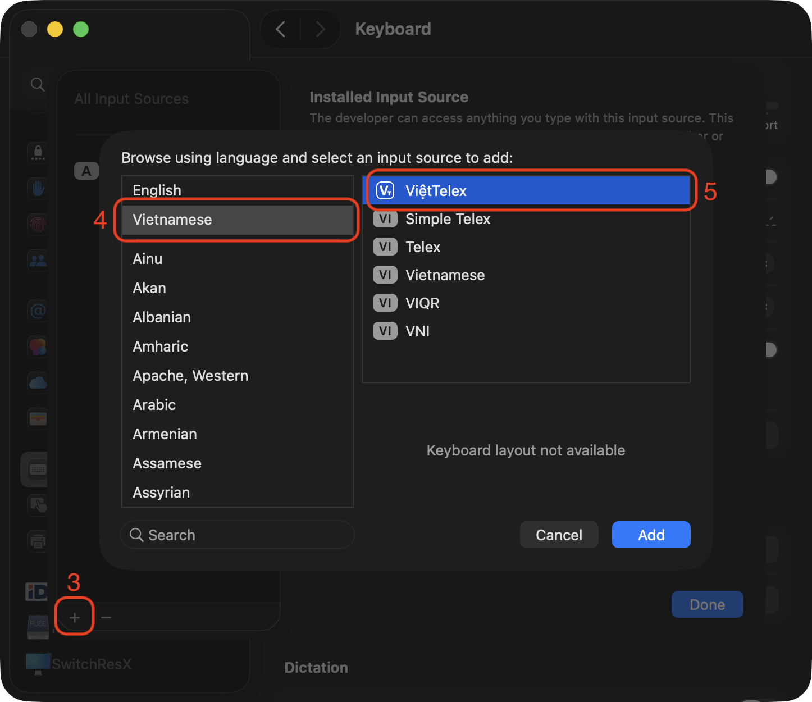

  

<h1 align="center">VietTelex</h1>

  
  
  
  

**VietTelex** (ViệtTelex / ViếtTelex) là bộ gõ tiếng Việt **Telex** cho macOS, được xây dựng trên **InputMethodKit** của Apple để tích hợp sâu. Không gạch chân từ đang gõ, con trỏ luôn ở cuối, dấu bỏ trực tiếp vào chữ, và gõ được cả trong **Terminal** mà không phá autocomplete của shell.

Triết lý: **tối giản, nhanh, ổn định, mã nguồn mở** — cài xong là gõ, hầu như không phải chỉnh gì thêm.

> Dự án của **Phil Trịnh**, viết lại từ đầu sau gần 20 năm dùng macOS mà chưa thấy bộ gõ tiếng Việt nào thật sự *ngon, chuẩn, mượt*.

## Điểm nổi bật

- **Chuẩn IMKit** — là input method thật của hệ thống (không phải app chặn phím), nên thừa hưởng miễn phí: tự đổi kiểu gõ theo từng app, chính tả/dự đoán/viết hoa của macOS, con trỏ/undo/VoiceOver đều đúng.
- **Nhanh** — luật chính tả compile thành trie + bitmap, incremental parse, SIMD, zero-alloc: **~130 ns/phím**, gõ nhanh cỡ nào cũng mượt.
- **Gõ được ở nơi bộ gõ khác hay vỡ** — Terminal/iTerm (giữ autocomplete shell), address bar Chrome, ô Excel, Spotlight; tự học theo từng app.
- **Thông minh với English/code** — tự khôi phục `google`/`github`, nhận token camelCase (`OmS`, `JavaScript`) để không bỏ dấu nhầm, có Telex nghiêm ngặt.
- **Nhẹ & riêng tư** — không chạy nền, không thu thập dữ liệu; chỉ gọi mạng khi bạn bấm *Kiểm tra cập nhật*.

| Menu trên thanh menu | Cửa sổ Cài đặt |
|---|---|
|  |  |

## Cài đặt

**Website:** [ptrinh.github.io/viettelex](https://ptrinh.github.io/viettelex/) · **Homebrew:** `brew install --cask ptrinh/viettelex/viettelex`

1. Tải **`VietTelex-x.y.z.pkg`** từ [Releases](https://github.com/ptrinh/viettelex/releases) (đã ký + notarized).
2. Double-click → làm theo hướng dẫn (tự cài, đăng ký bộ gõ, mở sẵn System Settings → Keyboard).
3. **Input Sources → Edit… / ＋ → Vietnamese → ViệtTelex → Add.**

| ① Input Sources → Edit… | ② ＋ → Vietnamese → ViệtTelex → Add |
|---|---|
|  |  |

Để gõ trong **Terminal, iTerm, Chrome/Edge/Brave**: bật quyền **Accessibility** cho VietTelex (Privacy & Security → Accessibility). Chuyển Việt/Anh bằng phím 🌐 hoặc ⌃Space (macOS nhớ theo từng app).

## Cách gõ

`s f r x j` = sắc huyền hỏi ngã nặng · `aa ee oo` = â ê ô · `aw ow uw` = ă ơ ư · `dd` = đ · `z` xóa dấu.
Ví dụ: `vieejt` → việt · `truowngf` → trường · `hoas` → hóa.

Tùy chọn (Simple Telex, bỏ dấu tự do, kiểu cũ/mới, kiểm tra chính tả, gõ tắt) ở menu bộ gõ → **Cài đặt…**

## Khắc phục sự cố

- **Không thấy trong Input Sources** → đăng xuất/đăng nhập lại một lần.
- **Không gõ được trong Terminal/Chrome** → cấp quyền Accessibility (đã bật mà vẫn lỗi thì bỏ tick rồi tick lại).
- **Ô mật khẩu** → tự tắt trong secure field (đúng hành vi).

## Đóng góp & giấy phép

Build, kiến trúc, benchmark: xem [`docs/CONTRIBUTE.md`](docs/CONTRIBUTE.md).

[MIT License](LICENSE) — © 2026 Phil Trinh (SENPRINTS LLC). Tự do dùng/sửa/tích hợp (kể cả thương mại), miễn giữ lại thông báo bản quyền.
